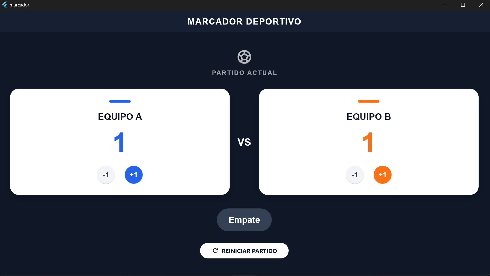
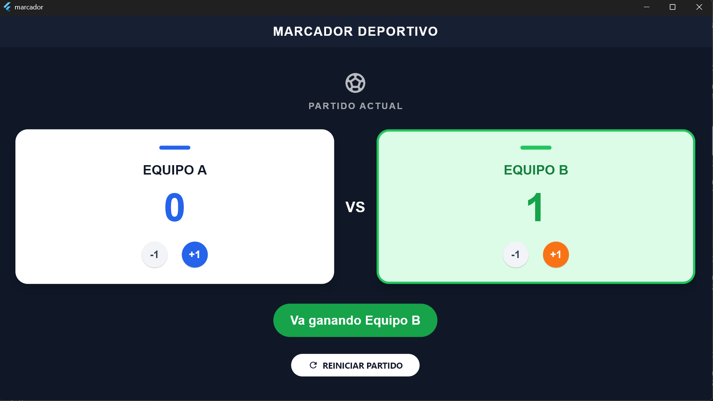
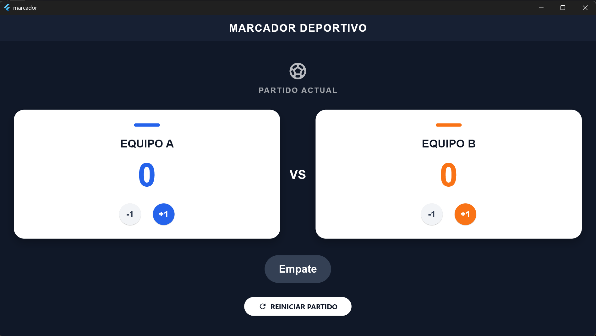

# Laboratorio - Marcador Deportivo

## Descripción

Aplicación desarrollada en Flutter que permite controlar el marcador de dos equipos deportivos y actualizar la interfaz de acuerdo con el resultado actual.

## Funcionalidades

- Puntuación inicial de 0-0.
- Botones +1 y -1 para cada equipo.
- Los puntos nunca pueden ser menores a cero.
- Muestra "Empate" cuando ambos equipos tienen la misma puntuación.
- Muestra "Va ganando Equipo A" o "Va ganando Equipo B" según el resultado.
- El equipo que va ganando se destaca en color verde.
- El botón Reiniciar devuelve el marcador a 0-0.

## Capturas de funcionamiento

### Empate

### Equipo A ganando

### Equipo B ganando

### Reinicio

## ¿Qué hace setState cuando se presiona un botón?

`setState()` le indica a Flutter que el estado del widget cambió. Al sumar o restar puntos, permite reconstruir la interfaz para mostrar inmediatamente la nueva puntuación, el mensaje correspondiente y el color del equipo que va ganando.

## ¿Qué ocurriría si cambio los puntos sin llamar a setState?

La variable cambiaría internamente, pero Flutter no recibiría la indicación de reconstruir la interfaz. Por eso, el nuevo valor podría no reflejarse inmediatamente en pantalla.